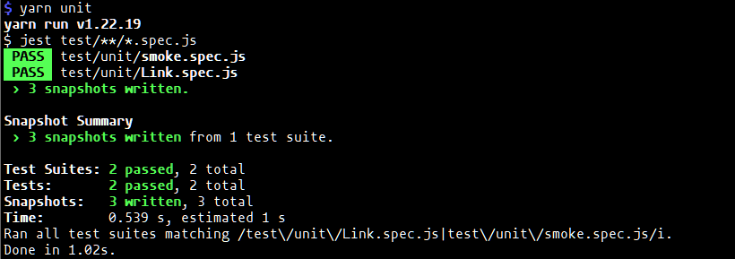

# Notes while following along

This tutorial is FIVE years, 2 months old as of 2023-12-03. Some details are obsolete
- Enzyme is no longer used for React component testing.

## Unit and component tests
Josh uses Jest and Mocha although mocha is older
Enzyme for React components

Mocha-Chai-Sinon takes a bit of setup
Cypress and Jest is easier for beginners

- Josh has learned to do outside-in testing, End to end for the whole app and unit/component testing.

### Have to replace Enzyme for React component testing

At this point we are still in tool setup and since the material is obsolete in terms of this aspect of tooling,
we will be sidetracked to set up the alternative to Enzyme.

React is at version 18.* and Enzyme last worked with React v16.*

These are some resources found regarding this issue:
- [This resource (2023-01-26)](https://hackernoon.com/enzyme-is-dead-heres-how-you-can-migrate) helps devs migrate out of Enzyme.
- [Top alternatives to Enzyme](https://stackshare.io/enzyme/alternatives)
  |icon| Library|Notes|References
  |---|---|---|---
  |[React Testing Library](https://github.com/testing-library/react-testing-library)|A simple and complete React DOM testing utility that encourage good testing.|<ul><li>[What Is React Testing Library?](https://www.youtube.com/watch?v=JKOwJUM4_RM)</li><li>[Testing In React Tutorial - Jest and React Testing Library](https://www.youtube.com/watch?v=JBSUgDxICg8)</li><li>[React Testing Tutorial with React Testing Library and Jest](https://www.youtube.com/watch?v=Flo268xRpV0)</li></ul>
  |[Mocha](https://stackshare.io/mocha)
  |[Jasmine](https://stackshare.io/jasmine)
  |[Cypress](https://stackshare.io/cypress)
  |[Jest](https://stackshare.io/jest)
  |[Chai](https://stackshare.io/chai)
  |[SinonJS](https://stackshare.io/sinonjs)
  |[Protractor](https://stackshare.io/protractor)

For this tutorial I am going to use [React Testing Libraray](https://testing-library.com/docs/react-testing-library/intro/)

```bash
yarn add --dev @testing-library/react
```

To use it with Jest we need:
```bash
yarn add --dev jest babel-jest @babel/preset-env @babel/preset-react react-test-renderer
```

`babel.config.js`
```js
module.exports = {
  presets: [
    '@babel/preset-env',
    ['@babel/preset-react', {runtime: 'automatic'}],
  ],
};
```

From the Jest [Testing React Apps]()https://jestjs.io/docs/tutorial-react page:

`Link.js`

```js
import {useState} from 'react';

const STATUS = {
  HOVERED: 'hovered',
  NORMAL: 'normal',
};

export default function Link({page, children}) {
  const [status, setStatus] = useState(STATUS.NORMAL);

  const onMouseEnter = () => {
    setStatus(STATUS.HOVERED);
  };

  const onMouseLeave = () => {
    setStatus(STATUS.NORMAL);
  };

  return (
    <a
      className={status}
      href={page || '#'}
      onMouseEnter={onMouseEnter}
      onMouseLeave={onMouseLeave}
    >
      {children}
    </a>
  );
}
```

`test/unit/Link.spec.js`

```js
import renderer from 'react-test-renderer';
import Link from '../Link';

it('changes the class when hovered', () => {
  const component = renderer.create(
    <Link page="http://www.facebook.com">Facebook</Link>,
  );
  let tree = component.toJSON();
  expect(tree).toMatchSnapshot();

  // manually trigger the callback
  renderer.act(() => {
    tree.props.onMouseEnter();
  });
  // re-rendering
  tree = component.toJSON();
  expect(tree).toMatchSnapshot();

  // manually trigger the callback
  renderer.act(() => {
    tree.props.onMouseLeave();
  });
  // re-rendering
  tree = component.toJSON();
  expect(tree).toMatchSnapshot();
});
```

Run
```bash
yarn unit
```

The results:


If using Jest 28 or later, jest-environment-jsdom package now must be installed separately.
```
yarn add --dev jest-environment-jsdom
```

jsdom is also no longer the default environment. You can enable jsdom globally by editing jest.config.js:

```js
 module.exports = {
+  testEnvironment: 'jsdom',
   // ... other options ...
 }
```

## Lint

```
yarn add --dev eslint eslint-config-codingitwrong
```

Note from [this stack overlow questions](https://stackoverflow.com/a/69557309/1418533):
The [babel-eslint parser](https://github.com/babel/babel-eslint) was deprecated in 2020.
This is the [current parser](https://github.com/babel/babel/tree/main/eslint/babel-eslint-parser)

CRLF issue: https://stackoverflow.com/a/66933780/1418533

```
yarn add --dev @babel/eslint-parser
```